# IronHack

## IronDiario KrystelDev

### HTML 7-11-22

📐 Este primer dia hacemos un repaso de las diferentes partes de un archivo HTML: Los meta tags, los diferentes tipos de tag (semanticos, tipos de letras, listas, tablas...)

##### Previews:

<table>
    <tr>
    <td>
        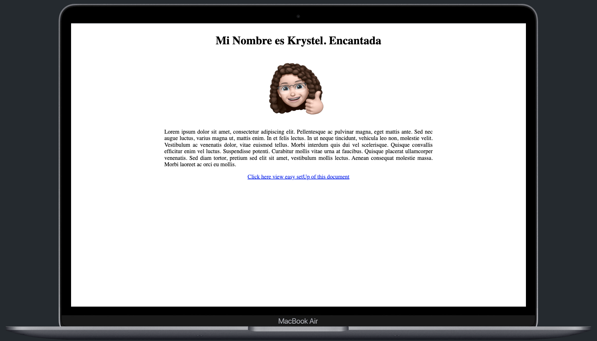
    </td>
    <td>
        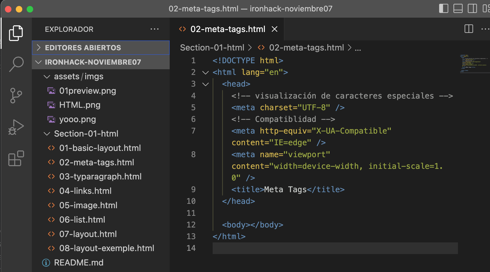
    </td>
    <td>
        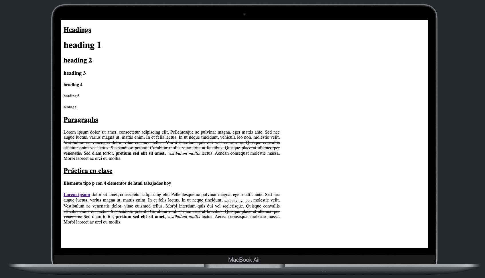
    </td>
    <td>
        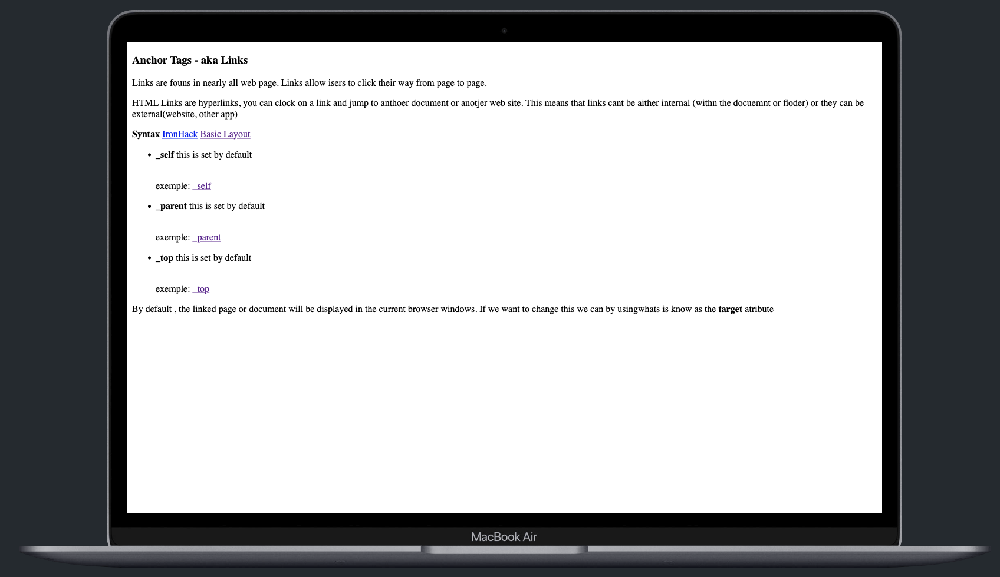
    </td>
    </tr>
    <tr>
    <td>
        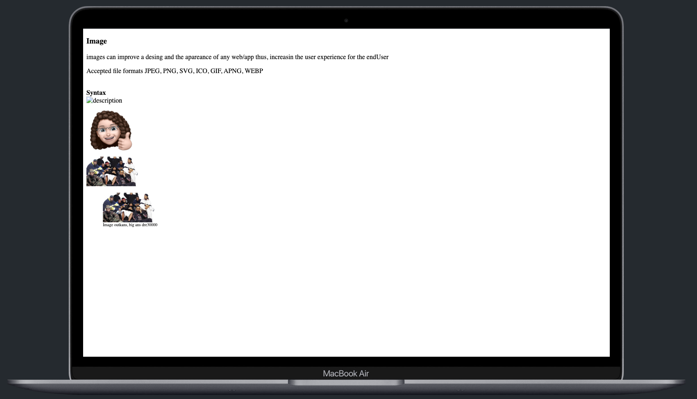
    </td>
    <td>
        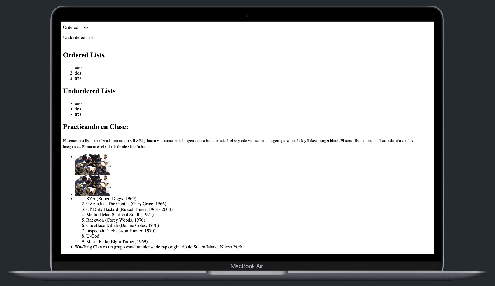
    </td>
    <td>
        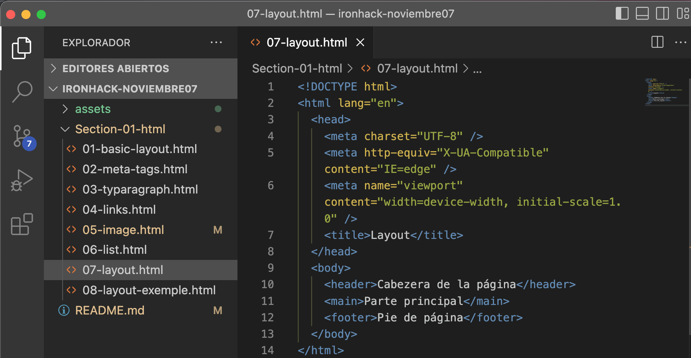
    </td>
    <td>
        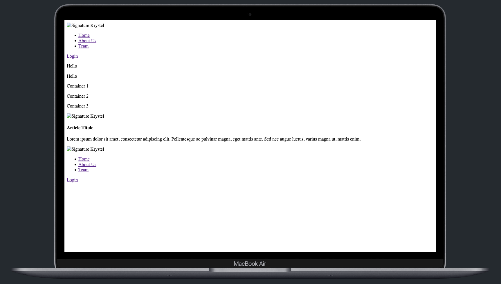
    </td>
    </tr>
</table>

### HTML && CSS 8-11-22

👩🏻‍🎨 Empezamos a estilar la web!
Hemos hablado que hay tres maneras de conectar HTML con CSS.

<ul>
    <li>Añadir un tag style dentro del head del archivo HTML</li>
    <li>Añadir una propiedad de style dentro del tag de apertura que queremos editar</li>
    <li>Añadir un link, en  el head, donde HTML pueda acceder al archivo CSS</li>
</ul>
A partir de aquí hablamos de los selectores que podemos usar para hacer referencias con el CSS y poder personalizar nuestra pantalla.
Hemos visto diferentes propiedades de css: tamaño de letra, tipo de letra, grossor de letra, border, fondos...

##### Previews:

<table>
    <tr>
    <td>
        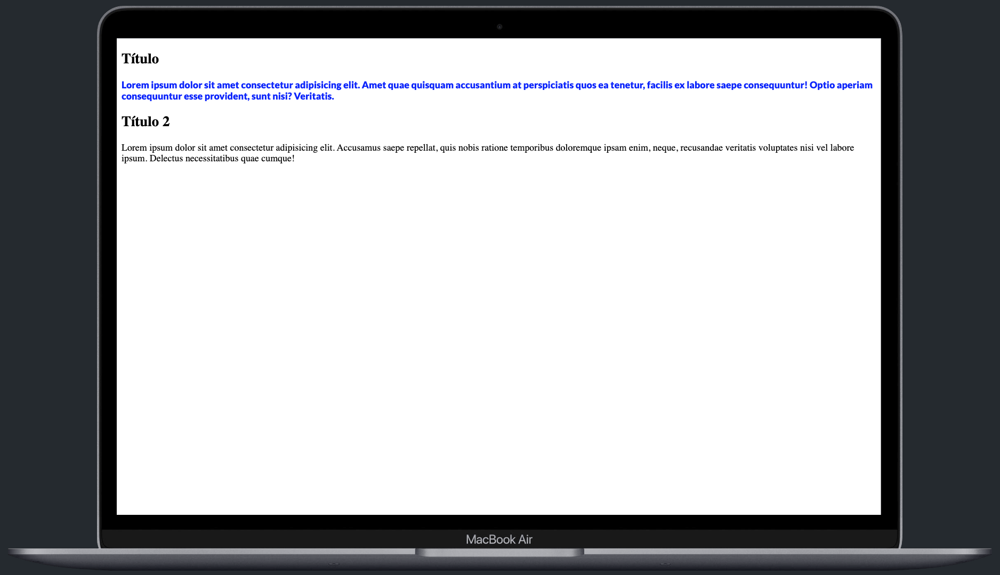
    </td>
    <td>
        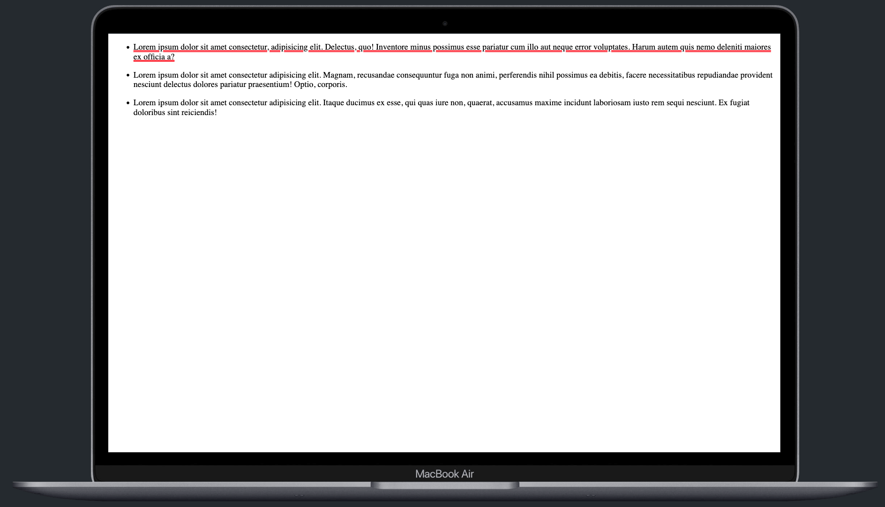
    </td>
    <td>
        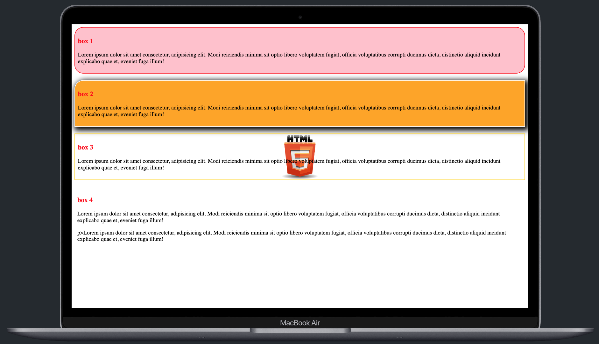
    </td>
    </tr>
</table>

### HTML && CSS 9-11-22

🎨 Seguimos preparando nuestras herramientas para decorar la web.
Cada día las practicas tienen más peso en nuestras clases.

Hoy hemos practicado las propiedades de float, links y buttons. Otra actividad con gran peso del dia de hoy ha sido la de dirigirnos al hermano de algún elemento específico. Otra manera de dirigirnos a algun elemento es por su posicionamiento.

📝 Algo que vimos de HTML en este día ha sido los formularios. Form, label, input, types inputs... incluso hemos empezado a tocar algo de logica con javascrip.

##### Previews:

<table>
    <tr>
    <td>
        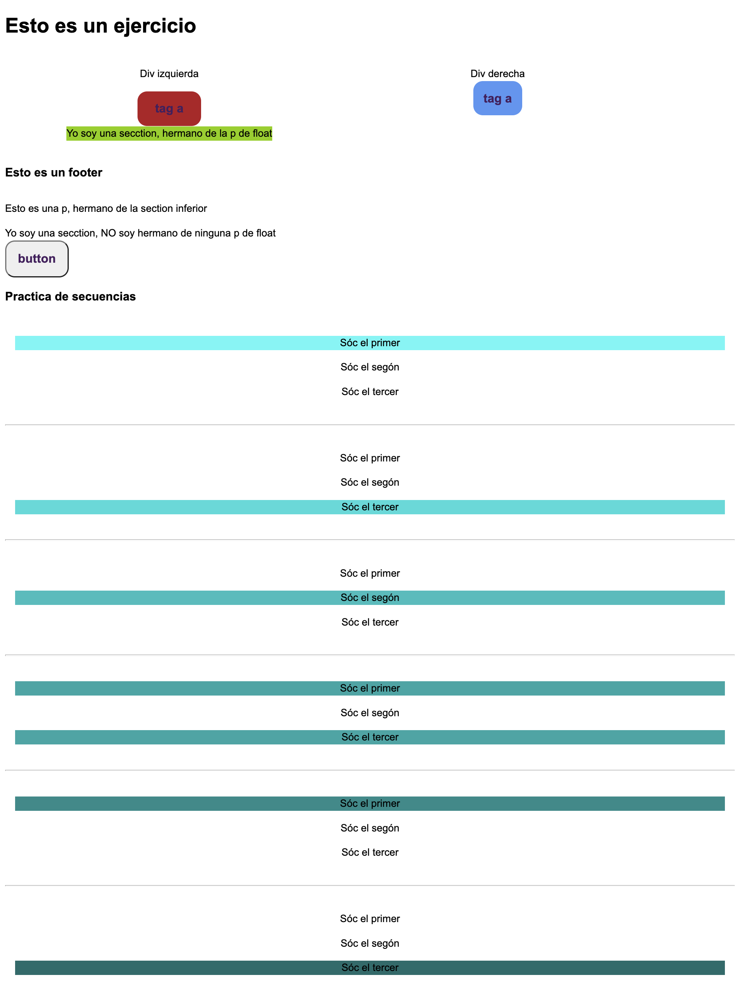
    </td>
    <td>
        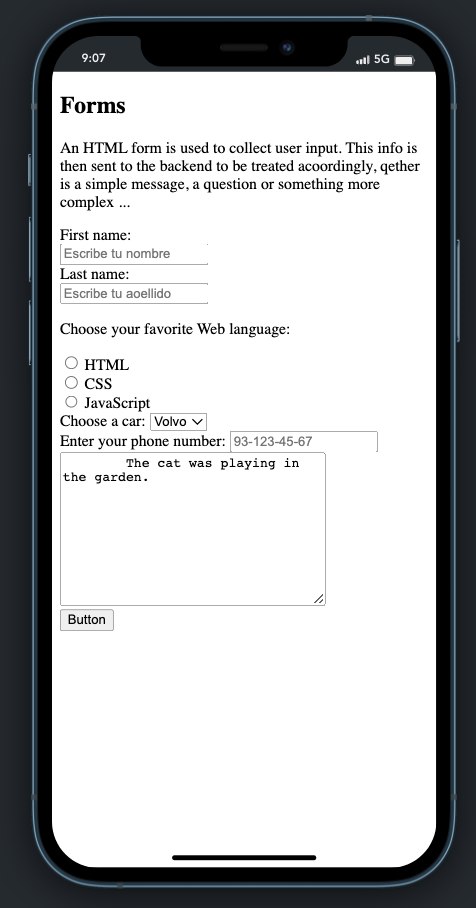
    </td>
    </tr>
</table>

### HTML && CSS 10-11-22

🗃️Flex vs 🗄️Grid. Vimos que de ambas maneras se puede organizar los contnedores de las páginas webs. Pero esta vez hemos ido un paso más allá.

¿Cual es el dispositivo que más consultamos al día?... Tará! Efectivamente el móvil! Es por ello que trabajamos con Media Query para poder adaptar nuestro proyecto en diferentes dispositivos.

💻📲 Media Query. Para que el aricho HTML sepa que debe actuar podemos linkearlo diciendo que para esos screen use otro archivo de css independiente, o podemos podemos poner esa excepción dentro de nuestro codigo CSS.

##### Previews:

<table>
    <tr>
    <td>
        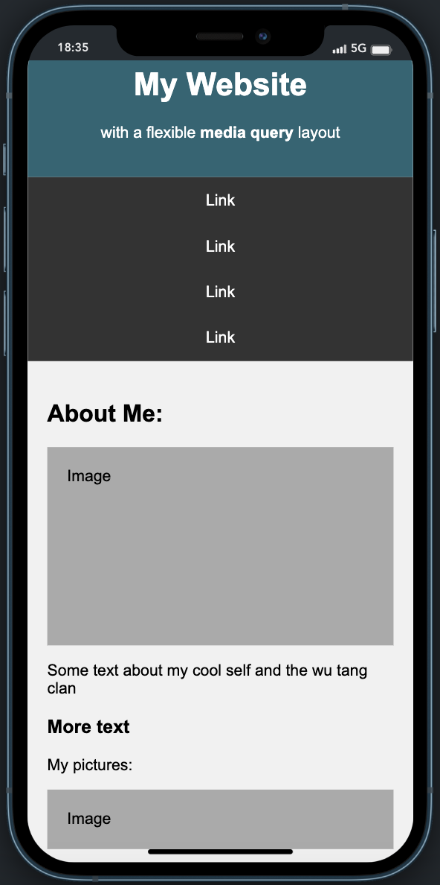
    </td>
    <td>
        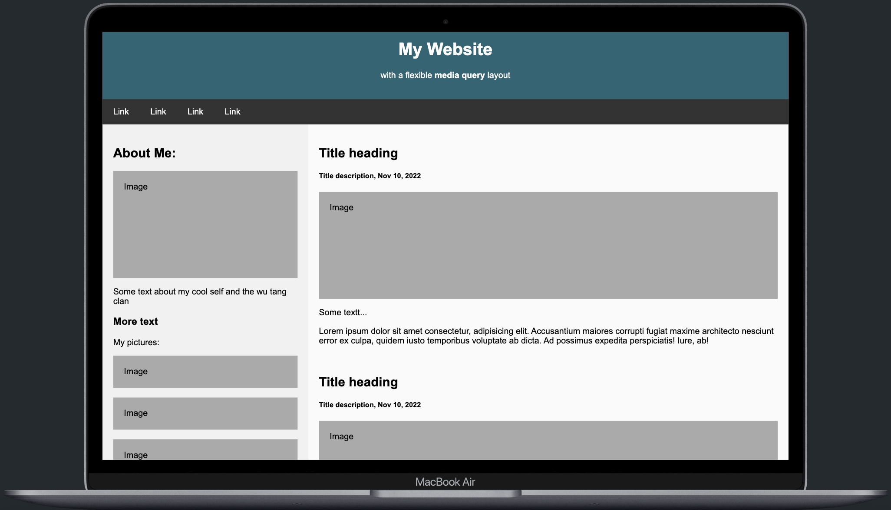
    </td>
    </tr>
</table>

### HTML && CSS 14-11-22

♨️ Despues de ver los diferentes tipos de variables que hay en js (primitivos y no primitivos), hemos trabajado con el condicional if esle y operadores.

##### Previews:

<table>
    <tr>
    <td>
        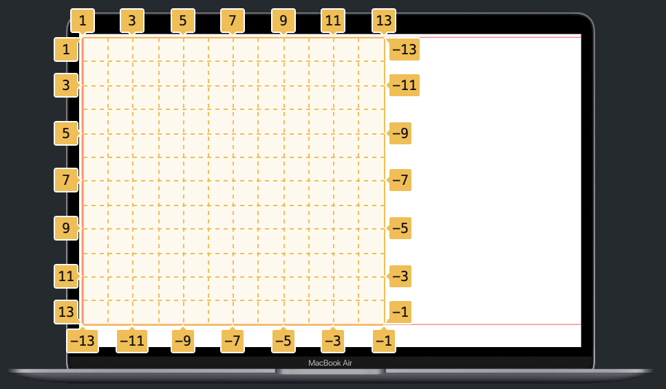
    </td>
    <td>
        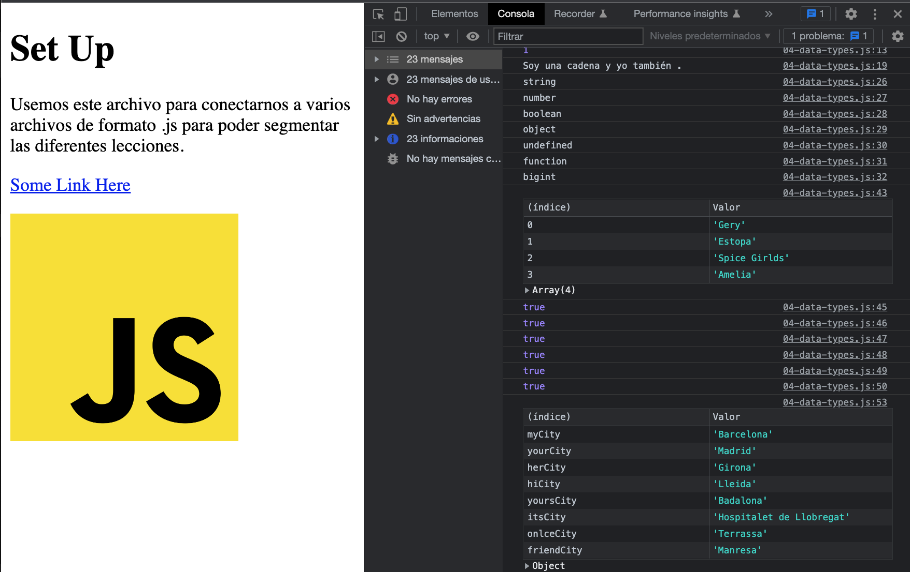
    </td>
    </tr>
</table>

### HTML && CSS 15-11-22

⏱️ Se va notando la presión contrarreloj que tenemos. Más información = a entregas las elaboradas y largas. Aprovechamos las primeras dos horas de la mañana para finalizar las entrega y hacer los últimos retoques.

📝 De teoría seguimos con JS. En el apartado de los condiciones añadimos a la lista switch. ¡Continuamos con los diferentes bucles (for, foreach, while, for in...), métodos de array y practicamos! Practicamos! practicamos!

##### Previews:

<table>
    <tr>
    <td>
        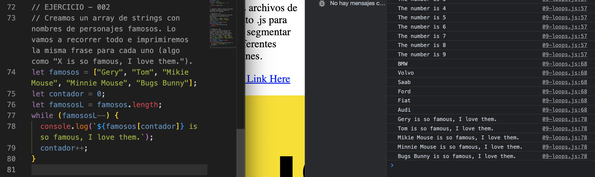
    </td>
    <td>
        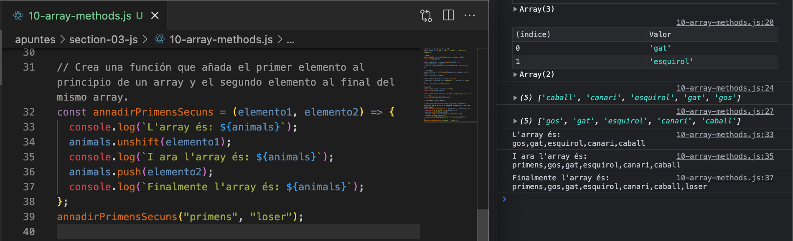
    </td>
    </tr>
</table>

### HTML && CSS 16-11-22

⏱️ Seguimos con la dinámica de dedicar dos horas para finalizar las entregas. Creo que si seguimos igual de buen ritmo con las clases teóricas es posible que esta organización se quede

👩🏻‍🍳 JS es muy grande y sabemos que aún queda chicha para repartir. Para seguir con js vanilla necesitamos tener un buen conocimiento de los selectores que se usan en el DOM. Así que continuamos, apuntar, crear, posicionar, modificar y eliminar. ¡Un día completo!

##### Preview:

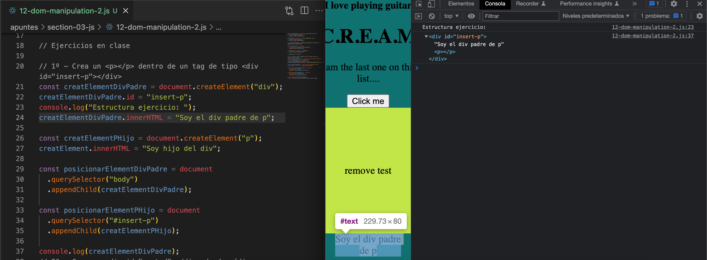

### HTML && CSS 17-11-22

👩🏻‍🏫 En la práctica está el maestro. Esta parece la regla por excelencia de aprendizaje en programación. Por la mañana dos horas para seguir trabajando con el laboratorio que empezamos el día anterior.

🛒 Este laboratorio es muy interesante, se trata de simular la vista de un carrito y su lógica. Añadir o reducir cantidad, calcular el importe total de cada producto según la cantidad elegida, el subtotal de coste de todos los productos añadidos en cesta...

##### Preview:

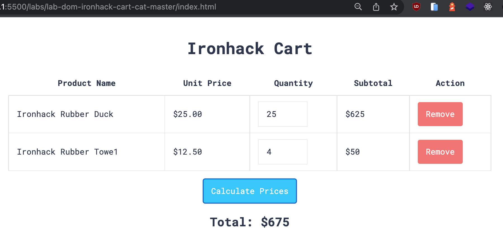

### HTML && CSS 18-11-22

🍿 Hoy seguimos con otra práctica muyyy interesante. En este caso tenemos un listado de películas. Nos piden más de 6 ejercicios donde en cada uno debemos pasar más de 4 test. Hacer un buscador de las películas por director, ordenar las películas de más nuevas a más antiguas y en caso de que sean del mismo año se ordenarían por orden alfabético, filtrar de las películas de X director, las que son de género drama, hacer una lista de las 20 mejores películas según su valoración, hacer una media de valoración de películas etc.

🤞🏻 Te lo prometo! le dijo el archivo JS al developer... Por la tarte estuvimos hablando de la asincronia y las promesas. con el tiempo final que quedó estuvimos haciendo pequeños ejericios en común.

##### Preview:

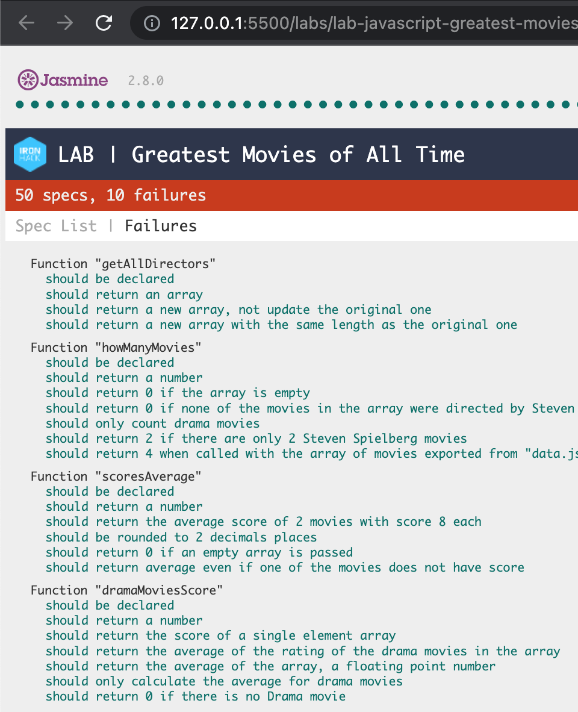

### HTML && CSS 21-11-22

🤞🏻 Promesas, promesas y más promesas... Por lo menos en JS nunca incumplen su palabra. Uno de tantos ejemplos en clase en preview de hoy.

📰 En la última hora del día nos presentan el proyecto que deberemos entregar y presentar a finales de esta semana. debemos intentar planificarnos nosotros mismos para llegar a tiempo.

El proyecto consiste en simular que estamos en una empresa, hemos tenido una reunión donde nos entregan la maquetación por figma. Nos dicen que tenemos fecha límite y lanzamiento para el viernes a las 14h.🚀

##### Preview:

### HTML && CSS 22-11-22 hasta 25-11-22

⏲️ La cuenta atrás ya esta activado.

Está serà la planificación prevista:

Lunes 21, noviembre, 2022:

- Creación del repositorio.
- Creación de las carpetas principales organizativas.
- Vincular proyecto local con el repositorio de git.
- Creación de primeros archivos.
- Vincular archivos entre sí.
- Planificar proyecto.

Martes 22, noviembre 2022

- Estructura HTML Home.
- Estructura HTML Contact us.
- Agregar navegación entre las páginas.
- Preparar el CSS mobile navbar.
- Preparar el CSS mobile sección de héroe.
- Preparar el CSS mobile sección Cliente.
- Preparar el CSS mobile sección de Proyectos.
- Preparar el CSS mobile sección de Testimonios.

Miercoles 23, noviembre 2022

- Preparar el CSS mobile sección de Servicios.
- Preparar el CSS mobile sección CTA (Call to Action).
- Preparar el CSS mobile sección de pie de página.
- Preparar el CSS PC navbar.
- Preparar el CSS PC sección de héroe.
- Preparar el CSS PC sección Cliente.
- Preparar el CSS PC sección de Proyectos.
- Preparar el CSS PC sección de Testimonios.
- Preparar el CSS PC sección de Servicios.
- Preparar el CSS PC sección CTA (Call to Action).
- Preparar el CSS PC sección de pie de página.

Jueves 24, noviembre 2022

- Finalizar la parte de hacer obligatorio todos los campos del formulario de contacto antes de poder enviarlo.
- Hacer obligatorio una estructura de email en sección CTA (Call to Action).
- Si enviamos el formulario, imprimir en consola. Si no saltar alert.
- Estructura HTML Home Proyect.
- Preparar el CSS mobile Home Proyect.
- Preparar el CSS tablet Home Proyect.
- Preparar el CSS PC Home Proyect.
- Api para dinamismo proyect selected .
- Repasar que este todo listo y retocar aquello que falte.

Viernes 25, noviembre 2022

- Repasar que este todo listo y retocar aquello que falte.
- Preparar presentación.
- Presentar mi proyecto.

##### Preview:

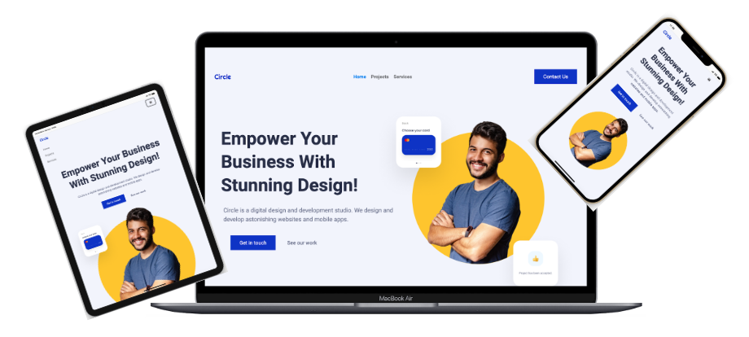

### VUE (init) 28-11-22

Primer contacto con el frameworks vue. Aprendemos los comando para iniciar y descargar el proyecto. A partir de aquí npm run dev para ir viendo como va quedando nuestro proyecto en el navegador local. Cosas iniciales importantes, estructura de un componente, como llamar a variables en template, como decirle al proyecto que cargue la web con cada cambio de esas variables (ref, reactive), y poder modificar atributos de html.

##### Preview:

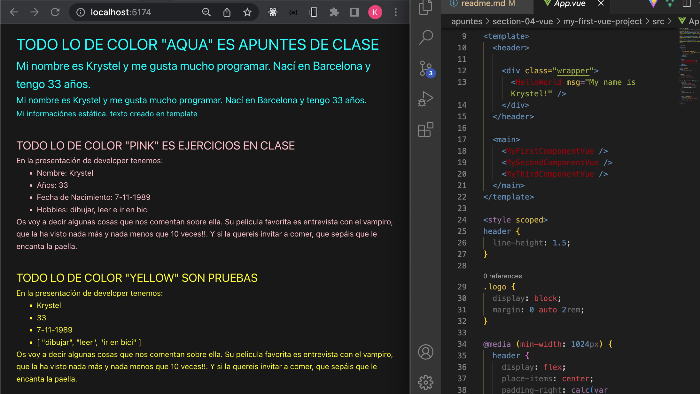

### VUE 28-11-22

Repasamos en conjunto el laboratorio que preparamos ayer individualmente.

Vemos algunos v-bind que ya empezamos ayer. En esta categoría también vemos el @click, os v-if, v-else, v-else-if y sus diferencias con v-show, v-for...

Invetigando por mi cuenta veo otros como el v-model para vincular el valor verdadero desde la variable que inserte.

Otra parte interesante que vemos es como armar el proyecto con vue-router.

##### Preview:

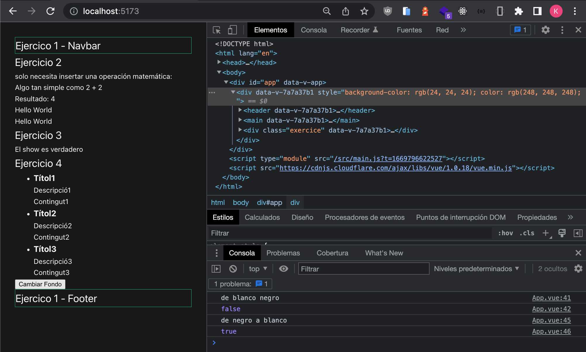
